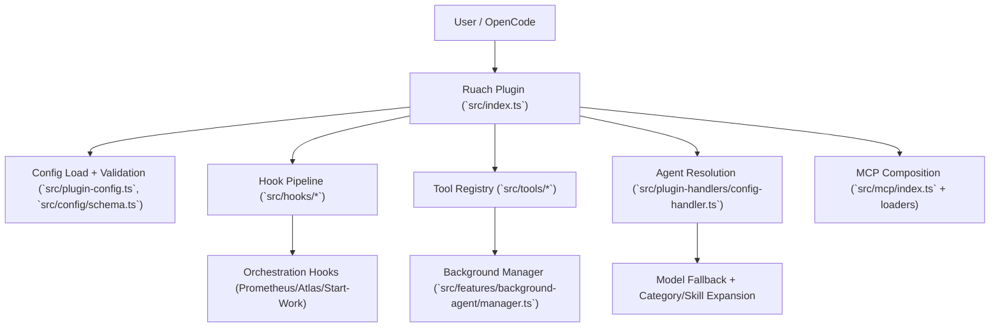

# Ruach System Deep Dive

This document explains what this repository implements, how it executes at runtime, and how data flows through its major subsystems.

## 1) System Identity and Primary Function

Ruach is an OpenCode plugin + CLI wrapper that turns OpenCode into a multi-agent orchestration runtime.

At a systems level, Ruach provides:
- A plugin bootstrap that registers tools, hooks, and config handlers (`src/index.ts`)
- A control plane for agent/model/permission configuration (`src/plugin-config.ts`, `src/config/schema.ts`, `src/plugin-handlers/config-handler.ts`)
- An execution plane for orchestration, background delegation, and tooling (`src/hooks/`, `src/tools/`, `src/features/background-agent/`)

## 2) Runtime Entry Points

- Plugin entrypoint: `src/index.ts`
- Config load + merge: `src/plugin-config.ts`
- Config schema + types: `src/config/schema.ts`
- CLI entrypoint: `src/cli/index.ts`

The plugin path is the core runtime. The CLI path is primarily for installation, diagnostics, and scripted operation.

## 3) High-Level Architecture

## 4) Control Flow: Plugin Startup

At plugin initialization (`src/index.ts`), Ruach:
1. Loads user/project ruach config (`loadPluginConfig`)
2. Materializes hook enablement state (`disabled_hooks`)
3. Instantiates managers (background, tmux, skill MCP, model cache)
4. Registers static + factory tools
5. Returns lifecycle handlers (`chat.message`, `event`, `tool.execute.before`, `tool.execute.after`, etc.)

This forms a deterministic startup graph: configuration first, then runtime capability construction, then event-driven execution.

## 5) Data Flow: Request Lifecycle

### 5.1 Prompt path (`chat.message`)
- Input prompt enters hook chain
- Keyword detector may inject mode directives (e.g., ultrawork)
- Claude compatibility hooks may transform/inject context
- Start-work hook may attach plan execution context
- Resulting transformed prompt is passed to OpenCode agent execution

### 5.2 Tool path (`tool.execute.before` → tool execution → `tool.execute.after`)
- Pre-tool hooks can gate/transform arguments
- Tool executes (LSP/search/delegation/session/skills/etc.)
- Post-tool hooks can append warnings, enforce orchestration behavior, and persist telemetry/transcript data

### 5.3 Event path (`event`)
- Session lifecycle events update session state, cleanup resources, recover from errors, and drive continuation behavior

## 6) Agent, Hook, and Tool Subsystems

## Agents
- Built-in and override-expanded in `createConfigHandler`
- Model selection is fallback-chain based and provider-aware
- Category and skill data can mutate per-agent runtime config

## Hooks
- Hooks are the central runtime policy layer:
  - Prompt transformation
  - Pre/post tool validation and augmentation
  - Continuation/recovery logic
  - Planner/executor behavioral constraints

## Tools
- Static tool set (`builtinTools`) + dynamic factories:
  - `delegate_task`, `call_omo_agent`, background tools, skill tools, slashcommand tool
- LSP, grep/glob, session-manager, AST-grep, and interactive bash are first-class operational tools

## 7) Orchestration and Plan Execution

Ruach separates planning and execution:
- Planning phase centered on Prometheus workflow
- Execution phase centered on Atlas workflow

`/start-work` integration (`src/hooks/start-work/index.ts`) creates/updates boulder state, then Atlas hooks use that state to enforce plan continuation and delegation discipline.

In practice:
- Plan state is persisted in project-local control files (`.sisyphus/*`)
- Atlas post-tool behavior injects verification/delegation reminders and progress continuity signals

## 8) Configuration and Precedence Model

### Runtime config
- Project: `.opencode/ruach.jsonc` then `.opencode/ruach.json`
- User: `<opencode-config-dir>/ruach.jsonc` then `<opencode-config-dir>/ruach.json`
- Merge behavior: project overrides user for overlapping fields (`mergeConfigs`)

### LSP config
LSP now follows ruach naming and precedence logic:
- Project ruach files first
- User ruach files second
- OpenCode base config as lower-priority source (`opencode.json`)

Merge order is `project > user > opencode`, with tolerant parsing (invalid JSON/JSONC is ignored per file).

## 9) CLI and Distribution Model

CLI surface (`src/cli/index.ts`):
- `install`, `run`, `doctor`, `get-local-version`, `version`

Operationally:
- Installer writes OpenCode plugin registration and ruach config
- Doctor performs dependency/auth/config/model/LSP diagnostics
- Build pipeline emits ESM plugin/CLI artifacts plus schema and platform binaries

## 10) Implemented vs Not Runtime-Wired

Implemented and runtime-wired:
- Core plugin/hook/tool/agent configuration path
- Background orchestration manager
- MCP merge path and skill command loading path

Implemented but not currently integrated into the main runtime bootstrap:
- Claude import translation utilities under `src/features/imports/claude/*` (library/tested surfaces, not core bootstrap wiring)

## 11) Operational Hotspots / Risk Zones

Areas with higher architectural complexity:
- `src/index.ts` (global runtime composition)
- `src/features/background-agent/manager.ts` (task lifecycle/concurrency)
- `src/hooks/atlas/index.ts` (orchestration governance)
- `src/tools/delegate-task/tools.ts` (delegation policy and execution shaping)

Primary failure modes to monitor:
- Hook ordering regressions
- Cross-session state contamination in tests
- Config/doc drift when schema or precedence changes

## 12) Contributor Mental Model

When changing behavior:
- Runtime wiring: `src/index.ts`
- New config fields/types: `src/config/schema.ts` + docs + loader/merge logic
- Agent resolution behavior: `src/plugin-handlers/config-handler.ts`
- Execution policy: relevant hooks in `src/hooks/`
- End-user operational interfaces: `src/cli/`

Use this rule:
- **Policy change** → hooks/config-handler
- **Capability change** → tools/agents/features
- **Contract change** → schema + docs + tests
