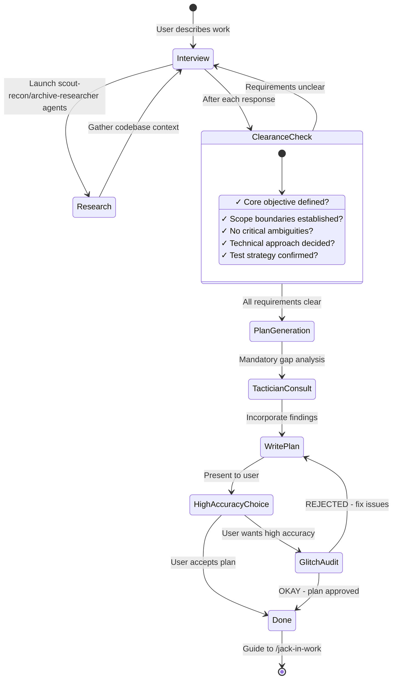
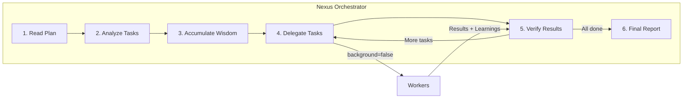

# Orchestration System

Ghostwire's orchestration system transforms a simple AI agent into a coordinated development team. This document explains how the Augur Planner → Nexus Orchestrator → Cipher Operator workflow creates high-quality, reliable code output.

---

## The Core Philosophy

Traditional AI coding tools follow a simple pattern: user asks → AI responds. This works for small tasks but fails for complex work because:

1. **Context overload**: Large tasks exceed context windows
2. **Cognitive drift**: AI loses track of requirements mid-task
3. **Verification gaps**: No systematic way to ensure completeness
4. **Human = Bottleneck**: Requires constant user intervention

The orchestration system solves these problems through **specialization and delegation**.

---

## The Three-Layer Architecture

```mermaid
flowchart TB
    subgraph Planning["Planning Layer (Human + Augur Planner)"]
        User[("User")]
        Augur Planner["Augur Planner (Planner)"]
        Tactician Strategist["Tactician Strategist (Consultant)"]
        Glitch Auditor["Glitch Auditor (Reviewer)"]
    end
    
    subgraph Execution["Execution Layer (Orchestrator)"]
        Orchestrator["Nexus Orchestrator (Conductor)"]
    end
    
    subgraph Workers["Worker Layer (Specialized Agents)"]
        Junior["Cipher Operator-Junior (Task Executor)"]
        Seer Advisor["Seer Advisor (Architecture)"]
        Scout Recon["Scout Recon (Codebase Grep)"]
        Archive Researcher["Archive Researcher (Docs/OSS)"]
    end
    
    User -->|"Describe work"| Augur Planner
    Augur Planner -->|"Consult"| Tactician Strategist
    Augur Planner -->|"Interview"| User
    Augur Planner -->|"Generate plan"| Plan[".ghostwire/plans/*.md"]
    Plan -->|"High accuracy?"| Glitch Auditor
    Glitch Auditor -->|"OKAY / REJECT"| Augur Planner
    
    User -->|"/jack-in-work"| Orchestrator
    Plan -->|"Read"| Orchestrator
    
    Orchestrator -->|"delegate_task(category)"| Junior
    Orchestrator -->|"delegate_task(agent)"| Seer Advisor
    Orchestrator -->|"delegate_task(agent)"| Scout Recon
    Orchestrator -->|"delegate_task(agent)"| Archive Researcher
    
    Junior -->|"Results + Learnings"| Orchestrator
    Seer Advisor -->|"Advice"| Orchestrator
    Scout Recon -->|"Code patterns"| Orchestrator
    Archive Researcher -->|"Documentation"| Orchestrator
```

---

## Layer 1: Planning

### Augur Planner: Your Strategic Consultant

Augur Planner is **not just a planner** - it's an intelligent interviewer that helps you think through what you actually need.

**The Interview Process:**



**Intent-Specific Strategies:**

| Intent | Augur Planner Focus | Example Questions |
|--------|------------------|-------------------|
| **Refactoring** | Safety - behavior preservation | "What tests verify current behavior?" "Rollback strategy?" |
| **Build from Scratch** | Discovery - patterns first | "Found pattern X in codebase. Follow it or deviate?" |
| **Mid-sized Task** | Guardrails - exact boundaries | "What must NOT be included? Hard constraints?" |
| **Architecture** | Strategic - long-term impact | "Expected lifespan? Scale requirements?" |

### Tactician Strategist: The Gap Analyzer

Before Augur Planner writes the plan, **Tactician Strategist catches what Augur Planner missed**:

- Hidden intentions in user's request
- Ambiguities that could derail implementation
- AI-slop patterns (over-engineering, scope creep)
- Missing acceptance criteria
- Edge cases not addressed

### Glitch Auditor: The Ruthless Reviewer

For high-accuracy mode, Glitch Auditor validates plans against **four core criteria**:

1. **Clarity**: Does each task specify WHERE to find implementation details?
2. **Verification**: Are acceptance criteria concrete and measurable?
3. **Context**: Is there sufficient context to proceed without >10% guesswork?
4. **Big Picture**: Is the purpose, background, and workflow clear?

The Glitch Auditor only says "OKAY" when:
- 100% of file references verified
- ≥80% of tasks have clear reference sources
- ≥90% of tasks have concrete acceptance criteria
- Zero tasks require assumptions about business logic
- Zero critical red flags

If REJECTED, Augur Planner fixes issues and resubmits. **No maximum retry limit.**

---

## Layer 2: Execution

### The Conductor Mindset

The Orchestrator is like an orchestra conductor: **it doesn't play instruments, it ensures perfect harmony**.



**What Orchestrator CAN do:**
- ✅ Read files to understand context
- ✅ Run commands to verify results
- ✅ Use lsp_diagnostics to check for errors
- ✅ Search patterns with grep/glob/ast-grep

**What Orchestrator MUST delegate:**
- ❌ Writing/editing code files
- ❌ Fixing bugs
- ❌ Creating tests
- ❌ Git commits

### Wisdom Accumulation

The power of orchestration is **cumulative learning**. After each task:

1. Extract learnings from subagent's response
2. Categorize into: Conventions, Successes, Failures, Gotchas, Commands
3. Pass forward to ALL subsequent subagents

This prevents repeating mistakes and ensures consistent patterns.

**Notepad System:**

```
.ghostwire/notepads/{plan-name}/
├── learnings.md      # Patterns, conventions, successful approaches
├── decisions.md      # Architectural choices and rationales
├── issues.md         # Problems, blockers, gotchas encountered
├── verification.md   # Test results, validation outcomes
└── problems.md       # Unresolved issues, technical debt
```

### Parallel Execution

Independent tasks run in parallel:

```typescript
// Orchestrator identifies parallelizable groups from plan
// Group A: Tasks 2, 3, 4 (no file conflicts)
delegate_task(category="ultrabrain", prompt="Task 2...")
delegate_task(category="visual-engineering", prompt="Task 3...")
delegate_task(category="general", prompt="Task 4...")
// All run simultaneously
```

---

## Layer 3: Workers

### Cipher Operator-Junior: The Task Executor

Junior is the **workhorse** that actually writes code. Key characteristics:

- **Focused**: Cannot delegate (blocked from task/delegate_task tools)
- **Disciplined**: Obsessive todo tracking
- **Verified**: Must pass lsp_diagnostics before completion
- **Constrained**: Cannot modify plan files (READ-ONLY)

Junior doesn't need to be the smartest - it needs to be reliable. With:
1. Detailed prompts from Orchestrator (50-200 lines)
2. Accumulated wisdom passed forward
3. Clear MUST DO / MUST NOT DO constraints
4. Verification requirements

Even a mid-tier model executes precisely. The intelligence is in the **system**, not individual agents.

### System Reminder Mechanism

The hook system ensures Junior never stops halfway:

```
[SYSTEM REMINDER - TODO CONTINUATION]

You have incomplete todos! Complete ALL before responding:
- [ ] Implement user service ← IN PROGRESS
- [ ] Add validation
- [ ] Write tests

DO NOT respond until all todos are marked completed.
```

---

## When to Use What

| Complexity | Approach | When to Use |
|------------|----------|-------------|
| **Simple** | Just prompt | Simple tasks, quick fixes, single-file changes |
| **Complex + Lazy** | Just type `ulw` or `ultrawork` | Complex tasks where explaining context is tedious. Agent figures it out. |
| **Complex + Precise** | `@plan` → `/jack-in-work` | Precise, multi-step work requiring true orchestration. Augur Planner plans, Nexus Orchestrator executes. |

**Decision Flow:**

```
Is it a quick fix or simple task?
  └─ YES → Just prompt normally
  └─ NO  → Is explaining the full context tedious?
             └─ YES → Type "ulw" and let the agent figure it out
             └─ NO  → Do you need precise, verifiable execution?
                        └─ YES → Use @plan for Augur Planner planning, then /jack-in-work
                        └─ NO  → Just use "ulw"
```

---

## Commands

### `@plan [request]`

Invokes Augur Planner to start a planning session.

- Example: `@plan "I want to refactor the authentication system to NextAuth"`

### `/jack-in-work`

Executes the generated plan.

- Function: Finds plan in `.ghostwire/plans/` and enters execution mode.
- If there's interrupted work, automatically resumes from where it left off.

---

## Configuration

You can control related features in `ghostwire.json`.

```jsonc
{
  "cipher_agent": {
    "disabled": false,           // Enable Nexus Orchestrator orchestration (default: false)
    "planner_enabled": true,     // Enable Augur Planner (default: true)
    "replace_plan": true         // Replace default plan agent with Augur Planner (default: true)
  },
  
  "hooks": {
    "disabled": [
      // "jack-in-work",             // Disable execution trigger
      // "augur-planner-md-only"      // Remove Augur Planner write restrictions (not recommended)
    ]
  }
}
```

---

## Why This Architecture Works

### 1. Separation of Concerns

- **Planning** (Augur Planner): High reasoning, interview, strategic thinking
- **Orchestration** (Nexus Orchestrator): Coordination, verification, wisdom accumulation
- **Execution** (Junior): Focused implementation, no distractions

### 2. Explicit Over Implicit

Every Junior prompt includes:
- Exact task from plan
- Clear success criteria
- Forbidden actions
- All accumulated wisdom
- Reference files with line numbers

No assumptions. No guessing.

### 3. Trust But Verify

The Orchestrator **never trusts subagent claims**:
- Runs `lsp_diagnostics` at project level
- Executes full test suite
- Reads actual file changes
- Cross-references requirements

### 4. Model Optimization

Expensive models used only where needed:
- Planning decisions (once per project)
- Debugging consultation (rare)
- Complex architecture (rare)

Bulk work goes to cost-effective models.

---

## Best Practices

1. **Don't Rush**: Invest sufficient time in the interview with Augur Planner. The more perfect the plan, the faster the execution.
2. **Single Plan Principle**: No matter how large the task, contain all TODOs in one plan file (`.md`). This prevents context fragmentation.
3. **Active Delegation**: During execution, delegate to specialized agents via `delegate_task` rather than modifying code directly.

---

## Further Reading

- [Philosophy](./philosophy.md) - The principles behind the system
- [Plugin Architecture](./plugin-architecture.md) - Technical implementation details
- [System Deep Dive](./system-deep-dive.md) - Runtime subsystems and data flow
- [Reliability & Performance](./reliability-performance.md) - Analysis of the runtime pipeline
