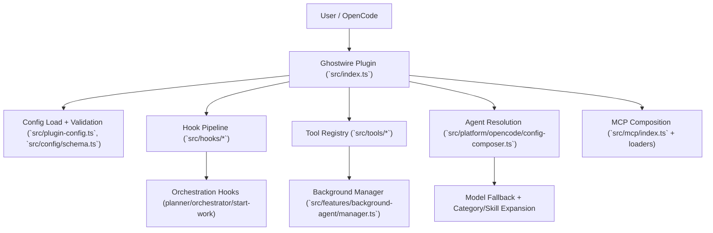

# Plugin Architecture

This document explains the Ghostwire plugin architecture, how it executes at runtime, and how data flows through its major subsystems.

---

## Overview

Ghostwire is an OpenCode plugin that turns OpenCode into a multi-agent orchestration runtime.

As of v3.2.x:
- Compound-engineering components are integrated directly into core runtime under the `grid:` namespace.
- Claude import/translation utilities exist as library code for migration/testing workflows.
- Feature bundle infrastructure has been removed to keep runtime deterministic and reduce maintenance surface.

---

## Architecture Layers

1. **Core Orchestration Runtime**
   - Native OpenCode agents, hooks, tools, MCP composition
   - Entry point: `src/index.ts`

2. **Integrated Components**
   - Compound agents/commands/skills wired into schema + runtime registries
   - Migration support via `src/config/migration.ts`

3. **Import/Mapping Utilities (Library-only)**
   - Claude plugin parsing/mapping/diagnostics in `src/features/imports/claude/`
   - Not invoked by plugin bootstrap path

---

## Runtime Composition

- Plugin bootstrap constructs managers/hooks/tools and returns lifecycle handlers.
- Config handler materializes effective agent/tool/command/mcp views from:
  - Built-ins
  - User/project overrides
  - OpenCode compatibility loaders where enabled

Key files:
- `src/index.ts` - Main plugin entry
- `src/plugin-config.ts` - Config load + merge
- `src/config/schema.ts` - Config schema + types
- `src/platform/opencode/config-composer.ts` - Effective config composition

---

## Config Scope and Precedence

**Runtime config:**
- Project: `.opencode/ghostwire.jsonc` then `.opencode/ghostwire.json`
- User: `<opencode-config-dir>/ghostwire.jsonc` then `<opencode-config-dir>/ghostwire.json`

**LSP config:**
- Project ghostwire files
- User ghostwire files
- OpenCode base config (`opencode.json`)

Merge order: `project > user > opencode`, with tolerant parsing (invalid JSON/JSONC is ignored per file).

---

## Runtime Entry Points

- Plugin entrypoint: `src/index.ts`
- Config load + merge: `src/plugin-config.ts`
- Config schema + types: `src/config/schema.ts`
- CLI entrypoint: `src/cli/index.ts`

The plugin path is the core runtime. The CLI path is primarily for installation, diagnostics, and scripted operation.

---

## High-Level Architecture

---

## Plugin Startup

At plugin initialization (`src/index.ts`), Ghostwire:
1. Loads user/project ghostwire config (`loadPluginConfig`)
2. Materializes hook enablement state (`disabled_hooks`)
3. Instantiates managers (background, tmux, skill MCP, model cache)
4. Registers static + factory tools
5. Returns lifecycle handlers (`chat.message`, `event`, `tool.execute.before`, `tool.execute.after`, etc.)

This forms a deterministic startup graph: configuration first, then runtime capability construction, then event-driven execution.

---

## Request Lifecycle

### Prompt path (`chat.message`)
- Input prompt enters hook chain
- Keyword detector may inject mode directives (e.g., ultrawork)
- Compatibility hooks may transform/inject context
- Start-work hook may attach plan execution context
- Resulting transformed prompt is passed to OpenCode agent execution

### Tool path (`tool.execute.before` → tool execution → `tool.execute.after`)
- Pre-tool hooks can gate/transform arguments
- Tool executes (LSP/search/delegation/session/skills/etc.)
- Post-tool hooks can append warnings, enforce orchestration behavior, and persist telemetry/transcript data

### Event path (`event`)
- Session lifecycle events update session state, cleanup resources, recover from errors, and drive continuation behavior

---

## Agent, Hook, and Tool Subsystems

### Agents
- Built-in and override-expanded in `createConfigHandler`
- Model selection is fallback-chain based and provider-aware
- Category and skill data can mutate per-agent runtime config

### Hooks
Hooks are the central runtime policy layer:
- Prompt transformation
- Pre/post tool validation and augmentation
- Continuation/recovery logic
- Planner/executor behavioral constraints

### Tools
- Static tool set (`builtinTools`) + dynamic factories:
  - `delegate_task`, `call_grid_agent`, background tools, skill tools, slashcommand tool
- LSP, grep/glob, session-manager, AST-grep, and interactive bash are first-class operational tools

---

## Orchestration and Plan Execution

Ghostwire separates planning and execution:
- Planning phase centered on planner workflow
- Execution phase centered on Nexus Orchestrator workflow

`/jack-in-work` integration creates/updates boulder state, then Nexus Orchestrator hooks use that state to enforce plan continuation and delegation discipline.

In practice:
- Plan state is persisted in project-local control files (`.ghostwire/*`)
- Nexus Orchestrator post-tool behavior injects verification/delegation reminders and progress continuity signals

---

## CLI and Distribution Model

CLI surface (`src/cli/index.ts`):
- `install`, `run`, `doctor`, `get-local-version`, `version`

Operationally:
- Installer writes OpenCode plugin registration and ghostwire config
- Doctor performs dependency/auth/config/model/LSP diagnostics
- Build pipeline emits ESM plugin/CLI artifacts plus schema and platform binaries

---

## Implemented vs Not Runtime-Wired

**Implemented and runtime-wired:**
- Core plugin/hook/tool/agent configuration path
- Background orchestration manager
- MCP merge path and skill command loading path

**Implemented but not currently integrated into the main runtime bootstrap:**
- Claude import translation utilities under `src/features/imports/claude/*` (library/tested surfaces, not core bootstrap wiring)

---

## Why Bundles Were Removed

Feature bundles were removed because they did not provide product leverage for a single-plugin runtime:
- no runtime registration path in bootstrap
- placeholder component loading in registry path
- duplicated conceptual model versus direct integration
- additional complexity for cache/lifecycle/error-state management

Direct integration is now the single source of runtime truth.

---

## Operational Hotspots

Areas with higher architectural complexity:
- `src/index.ts` (global runtime composition)
- `src/features/background-agent/manager.ts` (task lifecycle/concurrency)
- `src/orchestration/hooks/grid-sync/index.ts` (orchestration governance)
- `src/tools/delegate-task/tools.ts` (delegation policy and execution shaping)

Primary failure modes to monitor:
- Hook ordering regressions
- Cross-session state contamination in tests
- Config/doc drift when schema or precedence changes

---

## Contributor Guidance

When adding/changing behavior:
- Runtime flow: `src/index.ts`
- Config contract: `src/config/schema.ts`
- Effective config composition: `src/platform/opencode/config-composer.ts`
- Hook behavior/policies: `src/hooks/*`
- Tool behavior: `src/tools/*`

Use this rule:
- **Policy change** → hooks/config-handler
- **Capability change** → tools/agents/features
- **Contract change** → schema + docs + tests

Do not re-introduce dynamic bundle loading unless there is a concrete runtime requirement with measured product impact.

---

## Further Reading

- [Orchestration](./orchestration.md) - How agent coordination works
- [System Deep Dive](./system-deep-dive.md) - Detailed runtime subsystems
- [Reliability & Performance](./reliability-performance.md) - Analysis of the runtime pipeline
