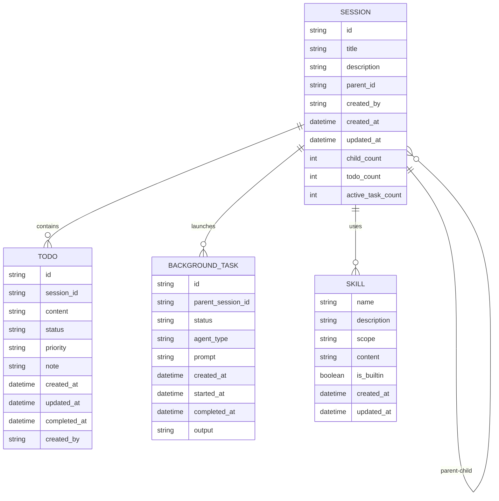

# Implement CRUD Operations for Core Entities to Achieve Agent-Native Architecture Parity

## Overview

This plan addresses the critical **CRUD Completeness gap (10%)** identified in the Agent-Native Architecture Review. Ghostwire currently exposes only 1 of 10 possible CRUD operations to agents, severely limiting agent autonomy and requiring users to manually manage sessions, todos, and skills.

**Goal**: Enable full agent self-management by exposing CRUD operations for Sessions, Todos, Skills, and Background Tasks through the tool system.

**Success Metric**: Increase CRUD Completeness score from 10% to 90%+ (9/10 operations exposed).

---

## Problem Statement

### Current State

Agents cannot programmatically manage their own workspace:

| Entity | Operations Available | Gap |
|--------|---------------------|-----|
| **Session** | list, read, search, info | Missing: create, update, delete |
| **Todo** | None (managed by OpenCode core) | Missing: create, read, update, delete |
| **Skill** | read (via load) | Missing: create, update, delete |
| **Background Task** | create, cancel | Missing: list, update, retry |

### Impact

1. **User Friction**: Users must manually create sessions, manage todos, and configure skills
2. **Lost Context**: Agents cannot create child sessions for parallel work
3. **Limited Autonomy**: Agents cannot self-organize their workspace
4. **Workflow Interruption**: Users must context-switch to manage infrastructure

### Real-World Scenarios

**Scenario 1**: Agent working on a feature needs to spawn 3 parallel analysis tasks. Currently: user must manually create 3 sessions. After: agent calls `session_create` 3 times.

**Scenario 2**: Agent identifies 5 follow-up tasks during code review. Currently: user must manually add todos. After: agent calls `todo_create` for each.

**Scenario 3**: Agent needs a custom skill for a domain. Currently: user must manually create SKILL.md file. After: agent calls `skill_create` with template.

---

## Proposed Solution

### Architecture Principles

1. **Agent-Native Design**: All CRUD operations must be callable by agents, not just users
2. **Consistency**: Follow existing tool patterns (factory functions for complex tools, direct definitions for simple ones)
3. **Safety**: Authorization checks, validation, and cascade policies prevent accidents
4. **Event-Driven**: CRUD operations emit events for hooks to react to

### Entity Specifications

#### 1. Session CRUD

**Current**: `src/tools/session-manager/tools.ts:29-147`

**New Operations**:

| Tool | Purpose | Complexity |
|------|---------|------------|
| `session_create` | Create new session (optionally as child) | Medium |
| `session_update` | Update session metadata (title, description) | Low |
| `session_delete` | Delete session with cascade options | High |

**Key Design Decisions**:
- **Authorization**: Session creator has full access; parent session creator can manage child sessions
- **Cascade Behavior**: Configurable via `cascade` parameter:
  - `cascade: false` (default): Reject delete if session has children, todos, or active tasks
  - `cascade: true`: Recursively delete all children, cancel tasks, archive todos
  - `force: true`: Bypass safety checks (use with caution)
- **Storage**: Use OpenCode client API (`client.session.create`)

**File Structure**:
```
src/tools/session-manager/
├── tools.ts          # Add session_create, session_update, session_delete (lines 148-400+)
├── types.ts          # Add CreateSessionArgs, UpdateSessionArgs, DeleteSessionArgs
├── constants.ts      # Add cascade policies, validation limits
└── index.ts          # Export new tools
```

**Example Usage**:
```typescript
// Create child session for parallel work
const child = await session_create({
  title: "Security audit - auth module",
  description: "Analyze authentication flows for vulnerabilities",
  parent_session_id: currentSessionId,
  initial_prompt: "Review the auth module..."
});

// Clean up completed work
await session_delete({
  session_id: child.id,
  cascade: true,  // Also delete children, cancel tasks
  reason: "Analysis complete, findings documented in parent"
});
```

#### 2. Todo CRUD

**Current**: Read-only via `src/tools/session-manager/storage.ts`

**New Operations**:

| Tool | Purpose | Complexity |
|------|---------|------------|
| `todo_create` | Create todo in current or specified session | Low |
| `todo_list` | List todos with filters (status, priority, session) | Low |
| `todo_update` | Update todo content, status, priority | Low |
| `todo_delete` | Delete todo | Low |

**Key Design Decisions**:
- **Scope**: Todos remain session-scoped (no cross-session todos)
- **Storage**: Use OpenCode client API (`client.session.todo`)
- **Validation**: 
  - Content max 500 characters
  - Priority: "low" | "medium" | "high" | "critical"
  - Status: "pending" | "in_progress" | "completed" | "cancelled"
- **Integration**: Existing `todo-continuation-enforcer.ts` hook already listens to todo changes

**File Structure**:
```
src/tools/todo-manager/          # NEW directory
├── tools.ts                     # Todo CRUD tools
├── types.ts                     # Todo schemas
├── constants.ts                 # Validation limits
└── index.ts                     # Barrel export
```

**Example Usage**:
```typescript
// Create follow-up tasks
await todo_create({
  session_id: currentSessionId,
  content: "Add input validation to user registration",
  priority: "high",
  note: "Found during security audit - SQL injection risk"
});

// Mark complete and trigger continuation check
await todo_update({
  todo_id: "todo-123",
  status: "completed",
  completed_note: "Added parameterized queries"
});
```

#### 3. Skill CRUD

**Current**: `src/tools/skill/tools.ts:129-212` (load only)

**New Operations**:

| Tool | Purpose | Complexity |
|------|---------|------------|
| `skill_create` | Create new skill from template | High |
| `skill_update` | Update skill metadata or content | High |
| `skill_delete` | Delete custom skill | Medium |
| `skill_list` | List available skills (builtin + custom) | Low |

**Key Design Decisions**:
- **Builtin Protection**: Builtin skills (prefix: `grid:`) cannot be modified or deleted
- **Storage**: File-based in `~/.config/opencode/skills/` (user) or `.opencode/skills/` (project)
- **Validation**: Use existing `SkillDefinitionSchema` from `src/config/schema.ts:454-467`
- **Template System**: Provide templates for common skill types (agent, tool, hook, analysis)
- **Cache Invalidation**: Clear skill cache on create/update/delete

**File Structure**:
```
src/tools/skill/
├── tools.ts              # Add skill_create, skill_update, skill_delete, skill_list
├── types.ts              # Add skill CRUD types
├── constants.ts          # Add templates, validation rules
├── templates/            # NEW - SKILL.md templates
│   ├── agent-skill.md
│   ├── tool-skill.md
│   ├── hook-skill.md
│   └── analysis-skill.md
└── index.ts              # Export new tools
```

**Example Usage**:
```typescript
// Create a domain-specific analysis skill
await skill_create({
  name: "rails-security-audit",
  description: "Analyze Rails code for security vulnerabilities",
  template: "analysis-skill",
  scope: "user",  // or "project"
  variables: {
    domain: "Ruby on Rails",
    focus_areas: ["SQL injection", "XSS", "CSRF", "mass assignment"]
  }
});

// Update skill after learning new pattern
await skill_update({
  skill_name: "rails-security-audit",
  updates: {
    description: "Enhanced Rails security audit with GraphQL support"
  },
  append_to_content: "\n## GraphQL Specific Checks\n- Check for N+1 queries in resolvers\n..."
});
```

#### 4. Background Task Enhancements

**Current**: `src/features/background-agent/manager.ts:109-171` (create), partial tool exposure

**New Operations**:

| Tool | Purpose | Complexity |
|------|---------|------------|
| `background_task_list` | List tasks by session or status | Low |
| `background_task_update` | Retry, pause, or resume task | Medium |
| `background_task_info` | Get detailed task status and output | Low |

**Key Design Decisions**:
- **Storage**: Leverage existing `BackgroundManager` in-memory storage
- **Access Control**: Task creator or parent session creator can manage tasks
- **Operations**:
  - `retry`: Restart failed task from beginning
  - `pause`: Pause running task (if supported by agent)
  - `resume`: Resume paused or failed task
  - `cancel`: Already exists via `createBackgroundCancel`

**File Structure**:
```
src/tools/background-task/
├── tools.ts              # Add task_list, task_update, task_info
├── types.ts              # Add BackgroundTaskListArgs, BackgroundTaskUpdateArgs
├── constants.ts          # Add status enums, operation types
└── index.ts              # Export new tools
```

**Example Usage**:
```typescript
// List all tasks for current session
const tasks = await background_task_list({
  parent_session_id: currentSessionId,
  status: ["running", "failed"]  // Filter options
});

// Retry failed task
await background_task_update({
  task_id: "task-456",
  operation: "retry",
  reason: "Fixed the file permissions issue"
});
```

---

## Technical Approach

### Phase 1: Foundation & Session CRUD

**Week 1-2**

#### Tasks

1. **Define Authorization Model**
   - File: `src/tools/session-manager/types.ts`
   - Add `SessionPermissions` interface
   - Add ownership tracking to session metadata
   - **Acceptance Criteria**: 
     - [ ] Authorization model documented in code comments
     - [ ] Unit tests for permission checks

2. **Implement session_create**
   - File: `src/tools/session-manager/tools.ts:148-250`
   - Use OpenCode client API
   - Support parent-child relationships
   - **Acceptance Criteria**:
     - [ ] Can create root session
     - [ ] Can create child session with parent_session_id
     - [ ] Validates parent session exists
     - [ ] Returns session metadata on success
     - [ ] Proper error messages for failures

3. **Implement session_update**
   - File: `src/tools/session-manager/tools.ts:251-320`
   - Support updating: title, description, metadata
   - **Acceptance Criteria**:
     - [ ] Can update session title
     - [ ] Can update session description
     - [ ] Validates session exists
     - [ ] Authorization check passes

4. **Implement session_delete** (with cascade logic)
   - File: `src/tools/session-manager/tools.ts:321-450`
   - Implement cascade policies
   - Handle dependencies (todos, tasks, child sessions)
   - **Acceptance Criteria**:
     - [ ] Rejects delete if children exist (cascade: false)
     - [ ] Recursively deletes children (cascade: true)
     - [ ] Cancels active background tasks
     - [ ] Archives todos (doesn't delete for audit trail)
     - [ ] Authorization check passes
     - [ ] Proper error handling for each failure mode

5. **Add Event Emission**
   - File: `src/features/event-emitter/` (NEW or existing)
   - Emit: `session.created`, `session.updated`, `session.deleted`
   - **Acceptance Criteria**:
     - [ ] Events emitted after successful operations
     - [ ] Hooks can subscribe to events
     - [ ] Event payload includes session metadata

#### Testing

```typescript
// Test file: src/tools/session-manager/tools.test.ts

describe('session_create', () => {
  it('creates root session successfully', async () => {
    //#given no parent session
    //#when creating session
    //#then session created with correct metadata
  });

  it('creates child session with valid parent', async () => {
    //#given existing parent session
    //#when creating child session
    //#then child linked to parent
  });

  it('fails with invalid parent session', async () => {
    //#given non-existent parent_id
    //#when creating child session
    //#then throws SessionNotFoundError
  });
});

describe('session_delete', () => {
  it('deletes leaf session successfully', async () => {
    //#given session with no children
    //#when deleting session
    //#then session removed
  });

  it('rejects delete when children exist (cascade: false)', async () => {
    //#given session with children
    //#when deleting without cascade
    //#then throws SessionHasChildrenError
  });

  it('cascades delete to children (cascade: true)', async () => {
    //#given session with nested children
    //#when deleting with cascade
    //#then all sessions removed recursively
  });
});
```

#### Success Criteria

- [ ] All session CRUD operations implemented and tested
- [ ] Authorization model in place
- [ ] Cascade policies working correctly
- [ ] Events emitted for all operations
- [ ] Documentation updated

---

### Phase 2: Todo CRUD

**Week 3**

#### Tasks

1. **Create todo-manager tool directory**
   - Files: `src/tools/todo-manager/tools.ts`, `types.ts`, `constants.ts`, `index.ts`
   - **Acceptance Criteria**:
     - [ ] Directory structure follows tool conventions
     - [ ] Types use Zod schemas

2. **Implement todo_create**
   - Use OpenCode client API
   - Support session scoping
   - **Acceptance Criteria**:
     - [ ] Can create todo in current session
     - [ ] Can create todo in specified session
     - [ ] Validates session exists
     - [ ] Enforces content length limit (500 chars)

3. **Implement todo_list**
   - Support filters: status, priority, session_id
   - **Acceptance Criteria**:
     - [ ] Lists todos for session
     - [ ] Filters by status correctly
     - [ ] Filters by priority correctly
     - [ ] Returns empty array for no matches

4. **Implement todo_update**
   - Support: content, status, priority, notes
   - **Acceptance Criteria**:
     - [ ] Can update all fields
     - [ ] Status transitions validated (e.g., can't go from completed → pending)
     - [ ] Completion timestamp auto-set

5. **Implement todo_delete**
   - Support force delete option
   - **Acceptance Criteria**:
     - [ ] Soft delete (archive) by default
     - [ ] Hard delete with force flag
     - [ ] In-progress todos require force

6. **Integrate with todo-continuation-enforcer**
   - Existing hook at `src/hooks/todo-continuation-enforcer.ts`
   - Ensure hook reacts to todo updates
   - **Acceptance Criteria**:
     - [ ] Hook triggers on todo status change
     - [ ] Continuation prompt shown when todos remain

#### Testing

```typescript
// Test file: src/tools/todo-manager/tools.test.ts

describe('todo_create', () => {
  it('creates todo in current session', async () => {
    //#given valid session
    //#when creating todo
    //#then todo created with correct metadata
  });

  it('rejects todo with content too long', async () => {
    //#given content > 500 chars
    //#when creating todo
    //#then throws ValidationError
  });
});

describe('todo_update', () => {
  it('updates status and sets completed_at', async () => {
    //#given pending todo
    //#when marking completed
    //#then status updated and timestamp set
  });
});
```

#### Success Criteria

- [ ] All todo CRUD operations implemented and tested
- [ ] Integration with continuation hook verified
- [ ] Validation rules enforced
- [ ] Documentation updated

---

### Phase 3: Skill CRUD

**Week 4-5**

#### Tasks

1. **Define Skill Templates**
   - Files: `src/tools/skill/templates/*.md`
   - Create templates: agent, tool, hook, analysis
   - **Acceptance Criteria**:
     - [ ] Each template has valid SKILL.md structure
     - [ ] Templates include variable substitution
     - [ ] Templates documented

2. **Implement skill_list**
   - List builtin + custom skills
   - Support filtering by scope (user/project)
   - **Acceptance Criteria**:
     - [ ] Returns all available skills
     - [ ] Distinguishes builtin vs custom
     - [ ] Shows skill metadata

3. **Implement skill_create**
   - File-based skill creation
   - Template system
   - **Acceptance Criteria**:
     - [ ] Creates SKILL.md from template
     - [ ] Validates skill name (unique, no builtin prefix)
     - [ ] Supports variable substitution
     - [ ] Invalidates skill cache
     - [ ] Returns skill path

4. **Implement skill_update**
   - Update metadata and/or content
   - **Acceptance Criteria**:
     - [ ] Can update description, tags, etc.
     - [ ] Can append to content
     - [ ] Can replace content
     - [ ] Rejects builtin skill updates
     - [ ] Invalidates cache

5. **Implement skill_delete**
   - Delete custom skills only
   - **Acceptance Criteria**:
     - [ ] Deletes skill file
     - [ ] Rejects builtin skill deletion
     - [ ] Invalidates cache
     - [ ] Handles "skill in use" warning

6. **Add Cache Invalidation**
   - Update `src/features/opencode-skill-loader/skill-content.ts`
   - Clear cache on CRUD operations
   - **Acceptance Criteria**:
     - [ ] Cache cleared after create/update/delete
     - [ ] New skills immediately available

#### Testing

```typescript
// Test file: src/tools/skill/tools.test.ts

describe('skill_create', () => {
  it('creates skill from template', async () => {
    //#given valid template and variables
    //#when creating skill
    //#then SKILL.md created correctly
  });

  it('rejects builtin skill name', async () => {
    //#given name starting with "grid:"
    //#when creating skill
    //#then throws ReservedNameError
  });

  it('invalidates cache after creation', async () => {
    //#given cached skill list
    //#when creating new skill
    //#then cache cleared
  });
});
```

#### Success Criteria

- [ ] All skill CRUD operations implemented and tested
- [ ] Template system functional
- [ ] Builtin skill protection working
- [ ] Cache invalidation verified
- [ ] Documentation updated

---

### Phase 4: Background Task Enhancements

**Week 6**

#### Tasks

1. **Implement background_task_list**
   - Query by session, status, agent type
   - **Acceptance Criteria**:
     - [ ] Lists tasks by parent session
     - [ ] Filters by status
     - [ ] Returns task summaries

2. **Implement background_task_info**
   - Detailed task information
   - **Acceptance Criteria**:
     - [ ] Returns full task metadata
     - [ ] Includes current output/log
     - [ ] Shows elapsed time

3. **Implement background_task_update**
   - Support operations: retry, pause, resume
   - **Acceptance Criteria**:
     - [ ] Can retry failed task
     - [ ] Can pause running task
     - [ ] Can resume paused task
     - [ ] Validates state transitions

4. **Integrate with Session CRUD**
   - Session delete should handle tasks
   - **Acceptance Criteria**:
     - [ ] Session delete cancels tasks
     - [ ] Cascade includes task cleanup

#### Testing

```typescript
// Test file: src/tools/background-task/tools.test.ts

describe('background_task_list', () => {
  it('lists tasks by session', async () => {
    //#given tasks in session
    //#when listing tasks
    //#then returns correct tasks
  });
});

describe('background_task_update', () => {
  it('retries failed task', async () => {
    //#given failed task
    //#when retrying
    //#then task restarted
  });
});
```

#### Success Criteria

- [ ] All background task operations implemented and tested
- [ ] Session/task integration working
- [ ] Documentation updated

---

### Phase 5: Integration & Polish

**Week 7-8**

#### Tasks

1. **Add Error Handling & Validation**
   - Consistent error messages across all CRUD tools
   - Input validation with Zod schemas
   - **Acceptance Criteria**:
     - [ ] All tools validate inputs
     - [ ] Error messages are actionable
     - [ ] Edge cases handled

2. **Update Tool Index**
   - File: `src/tools/index.ts`
   - Export all new tools
   - **Acceptance Criteria**:
     - [ ] All CRUD tools exported
     - [ ] Factory functions registered

3. **Add Documentation**
   - Update `src/tools/AGENTS.md`
   - Add CRUD tool reference
   - Create usage examples
   - **Acceptance Criteria**:
     - [ ] Documentation reflects new tools
     - [ ] Examples provided

4. **Integration Testing**
   - End-to-end CRUD workflows
   - Cross-entity operations
   - **Acceptance Criteria**:
     - [ ] Session + todo workflow tested
     - [ ] Skill + agent workflow tested
     - [ ] Background task lifecycle tested

5. **Performance Testing**
   - Benchmark CRUD operations
   - Verify no significant slowdown
   - **Acceptance Criteria**:
     - [ ] CRUD operations < 100ms locally
     - [ ] No memory leaks

6. **Update Plugin Registration**
   - File: `src/index.ts`
   - Register new tools with plugin
   - **Acceptance Criteria**:
     - [ ] All tools available in plugin
     - [ ] Tools listed in help

#### Success Criteria

- [ ] All phases complete
- [ ] Integration tests passing
- [ ] Documentation complete
- [ ] Performance acceptable
- [ ] Ready for release

---

## Technical Specifications

### Authorization Model

```typescript
// src/tools/session-manager/types.ts

interface SessionPermissions {
  owner: string;              // Agent identifier who created session
  read: string[];             // Agent patterns with read access
  write: string[];            // Agent patterns with write access
  delete: string[];           // Agent patterns with delete access
}

interface SessionMetadata {
  id: string;
  title: string;
  description?: string;
  parent_id?: string;
  created_by: string;
  created_at: Date;
  updated_at: Date;
  permissions: SessionPermissions;
  child_count: number;
  todo_count: number;
  active_task_count: number;
}
```

### Cascade Policies

```typescript
// src/tools/session-manager/constants.ts

interface DeleteSessionOptions {
  session_id: string;
  cascade?: boolean;          // Default: false
  force?: boolean;            // Default: false
  archive_todos?: boolean;    // Default: true
  reason?: string;            // Audit trail
}

enum CascadeBehavior {
  REJECT_IF_CHILDREN = 'reject',     // Safe default
  DELETE_CHILDREN = 'delete',        // Recursive delete
  ORPHAN_CHILDREN = 'orphan',        // Remove parent ref
  ARCHIVE_SESSION = 'archive'        // Soft delete
}
```

### Todo Schema

```typescript
// src/tools/todo-manager/types.ts

import { z } from 'zod';

const TodoPriority = z.enum(['low', 'medium', 'high', 'critical']);
const TodoStatus = z.enum(['pending', 'in_progress', 'completed', 'cancelled']);

const TodoSchema = z.object({
  id: z.string(),
  session_id: z.string(),
  content: z.string().max(500),
  status: TodoStatus,
  priority: TodoPriority,
  note: z.string().max(1000).optional(),
  created_at: z.date(),
  updated_at: z.date(),
  completed_at: z.date().optional(),
  created_by: z.string()
});

const CreateTodoArgsSchema = z.object({
  session_id: z.string().optional(),  // Default: current session
  content: z.string().min(1).max(500),
  priority: TodoPriority.default('medium'),
  note: z.string().max(1000).optional()
});
```

### Skill Schema

```typescript
// src/tools/skill/types.ts

const SkillScope = z.enum(['user', 'project']);

const CreateSkillArgsSchema = z.object({
  name: z.string().regex(/^[a-z0-9-]+$/),  // kebab-case, no builtin prefix
  description: z.string().min(10).max(200),
  template: z.enum(['agent', 'tool', 'hook', 'analysis']),
  scope: SkillScope.default('user'),
  variables: z.record(z.string()).optional()
});

const UpdateSkillArgsSchema = z.object({
  skill_name: z.string(),
  updates: z.object({
    description: z.string().optional(),
    tags: z.array(z.string()).optional()
  }).optional(),
  append_to_content: z.string().optional(),
  replace_content: z.string().optional()
}).refine(data => 
  data.updates || data.append_to_content || data.replace_content,
  { message: "At least one update field required" }
);
```

---

## Acceptance Criteria

### Functional Requirements

#### Session CRUD

- [ ] `session_create` creates new session with metadata
- [ ] `session_create` supports parent-child relationships
- [ ] `session_create` validates parent session exists
- [ ] `session_update` updates session metadata
- [ ] `session_update` validates authorization
- [ ] `session_delete` rejects delete if children exist (cascade: false)
- [ ] `session_delete` cascades to children (cascade: true)
- [ ] `session_delete` cancels active tasks
- [ ] `session_delete` archives todos (not hard delete)
- [ ] `session_delete` validates authorization

#### Todo CRUD

- [ ] `todo_create` creates todo in specified session
- [ ] `todo_create` validates content length
- [ ] `todo_list` lists todos with filters
- [ ] `todo_update` updates all fields
- [ ] `todo_update` validates status transitions
- [ ] `todo_delete` soft deletes by default
- [ ] `todo_delete` hard deletes with force flag
- [ ] Todos integrate with continuation hook

#### Skill CRUD

- [ ] `skill_list` lists all available skills
- [ ] `skill_list` distinguishes builtin vs custom
- [ ] `skill_create` creates SKILL.md from template
- [ ] `skill_create` validates name format
- [ ] `skill_create` prevents builtin prefix
- [ ] `skill_create` invalidates cache
- [ ] `skill_update` updates metadata
- [ ] `skill_update` appends/replaces content
- [ ] `skill_update` rejects builtin skills
- [ ] `skill_delete` deletes custom skills
- [ ] `skill_delete` rejects builtin skills
- [ ] `skill_delete` invalidates cache

#### Background Task Operations

- [ ] `background_task_list` lists tasks by session
- [ ] `background_task_list` filters by status
- [ ] `background_task_info` returns detailed status
- [ ] `background_task_update` retries failed tasks
- [ ] `background_task_update` pauses running tasks
- [ ] `background_task_update` resumes paused tasks

### Non-Functional Requirements

- [ ] All CRUD operations complete in < 100ms locally
- [ ] No memory leaks during extended use
- [ ] Errors are actionable and specific
- [ ] Events emitted for all operations
- [ ] Cache invalidation works correctly
- [ ] Authorization checks enforced

### Quality Gates

- [ ] Test coverage > 80% for new code
- [ ] All tests passing (bun test)
- [ ] Type check passing (bun run typecheck)
- [ ] Lint passing (bun run lint)
- [ ] Documentation complete
- [ ] Examples provided

---

## Success Metrics

### Primary Metric

- **CRUD Completeness Score**: Increase from 10% to 90%+
  - Current: 1/10 operations (10%)
  - Target: 9/10 operations (90%)

### Secondary Metrics

| Metric | Baseline | Target | Measurement |
|--------|----------|--------|-------------|
| Session CRUD | 40% (list/read/search/info) | 100% | Operations available / 5 |
| Todo CRUD | 0% | 100% | Operations available / 4 |
| Skill CRUD | 25% (read only) | 100% | Operations available / 4 |
| Background Task | 40% (create/cancel) | 100% | Operations available / 5 |
| Agent Autonomy Score | N/A | +50% | Survey agents on self-management capability |
| User Workflow Interruption | High | Low | Time spent on manual CRUD operations |

### User Impact Metrics

- **Session Creation Time**: User manually creates session → Agent creates session (< 5 seconds)
- **Todo Management**: User manually adds todos → Agent adds todos automatically
- **Skill Development**: User manually creates SKILL.md → Agent generates from template

---

## Dependencies & Prerequisites

### Technical Dependencies

1. **OpenCode Client API**: Must support session create/update/delete operations
   - Current: Read-only operations available
   - Risk: Low (OpenCode core supports these operations)

2. **File System Access**: Skill CRUD requires write access to skill directories
   - Current: Read-only skill loading
   - Risk: Low (standard file operations)

3. **Event System**: CRUD operations need to emit events for hooks
   - Current: Limited event support
   - Risk: Medium (may need to implement event emitter)

### Blockers

None identified. All dependencies are available or can be implemented.

### External Dependencies

None. This is purely internal Ghostwire architecture work.

---

## Risk Analysis & Mitigation

| Risk | Probability | Impact | Mitigation |
|------|-------------|--------|------------|
| **Breaking existing workflows** | Medium | High | Comprehensive testing, feature flags for gradual rollout |
| **Data loss during cascade delete** | Low | Critical | Default to safe mode (reject if children), archive before delete, audit trail |
| **Unauthorized access** | Low | High | Authorization checks on all destructive operations, ownership tracking |
| **Performance degradation** | Low | Medium | Benchmarking during development, lazy loading, caching |
| **Cache inconsistency** | Medium | Medium | Invalidate cache on all CRUD operations, add cache tests |
| **Concurrent modification conflicts** | Low | Medium | Optimistic locking or last-write-wins with conflict detection |

---

## Alternative Approaches Considered

### Alternative 1: Centralized CRUD Service

Instead of individual tool directories, create a single `src/services/crud.ts` that handles all entity CRUD.

**Rejected**: Violates Ghostwire's tool-based architecture. Tools should be self-contained and composable.

### Alternative 2: GraphQL-Style API

Expose CRUD through a unified GraphQL interface instead of individual tools.

**Rejected**: Overkill for current needs. Tools provide better type safety and discoverability in the agent-native architecture.

### Alternative 3: Soft Delete Everything

Instead of hard deletes, archive all entities for potential recovery.

**Partially Accepted**: Todos use soft delete by default. Sessions and skills use configurable cascade. Background tasks are ephemeral by design.

### Alternative 4: No Authorization Checks

Trust all agents and don't implement authorization.

**Rejected**: Security risk. Any compromised agent could delete all sessions. Authorization model is essential.

---

## Resource Requirements

### Team

- **1 Senior Developer**: Architecture, authorization, complex cascade logic
- **1 Developer**: Tool implementations, testing, documentation
- **QA**: Integration testing, edge case validation

### Time

- **Estimated Effort**: 8 weeks (2 developers)
- **Breakdown**:
  - Phase 1 (Session CRUD): 2 weeks
  - Phase 2 (Todo CRUD): 1 week
  - Phase 3 (Skill CRUD): 2 weeks
  - Phase 4 (Background Tasks): 1 week
  - Phase 5 (Integration): 2 weeks

### Infrastructure

- No additional infrastructure needed
- Standard development environment

---

## Future Considerations

### Extensibility

1. **Additional Entities**: Pattern established for adding CRUD to new entities
2. **Batch Operations**: Future addition of batch_create, batch_update, batch_delete
3. **Audit Trail**: Expand logging for compliance and debugging
4. **Undo/Redo**: Implement command pattern for undo support

### Integration Opportunities

1. **MCP Servers**: Skills with MCP servers need cleanup coordination
2. **Background Agents**: Enhanced task scheduling and resource management
3. **Analytics**: CRUD event stream for usage analytics

### Long-Term Vision

- **Fully Autonomous Agents**: Agents that can fully manage their workspace
- **Agent Collaboration**: Multiple agents working in shared sessions
- **Workspace Templates**: Pre-configured session + todo + skill bundles

---

## Documentation Plan

### Files to Update

1. **src/tools/AGENTS.md**
   - Add CRUD tools reference section
   - Document authorization model
   - Provide usage examples

2. **src/config/schema.ts comments**
   - Document new schemas

3. **docs/plans/ (this file)**
   - Keep as implementation reference

### New Documentation

1. **docs/guides/crud-workflows.md**
   - Common CRUD workflows
   - Best practices
   - Troubleshooting

2. **docs/examples/crud-usage.ts**
   - TypeScript examples for each CRUD operation

---

## References & Research

### Internal References

| File | Lines | Description |
|------|-------|-------------|
| `src/tools/session-manager/tools.ts` | 29-147 | Existing session tools (list/read/search/info) |
| `src/tools/session-manager/storage.ts` | 1-239 | Session storage patterns |
| `src/tools/delegate-task/tools.ts` | 270-1414 | Complex tool factory pattern example |
| `src/features/background-agent/manager.ts` | 109-171 | Task creation pattern |
| `src/config/schema.ts` | 454-467 | SkillDefinitionSchema |
| `src/hooks/todo-continuation-enforcer.ts` | 1-509 | Todo hook integration |
| `src/tools/skill/tools.ts` | 129-212 | Skill loading pattern |

### Research Insights

**From Repo Research**:
- Tools follow factory pattern for context-dependent operations
- Storage paths centralized in constants files
- Hook-based architecture for cross-cutting concerns
- Event system already exists for session management

**From SpecFlow Analysis**:
- Authorization model is critical gap requiring immediate attention
- Cascade delete policies must be configurable
- Concurrent modification needs conflict resolution
- Validation rules needed for all entities

---

## Implementation Checklist

### Pre-Implementation

- [ ] Review this plan with team
- [ ] Set up feature branch
- [ ] Create test scaffolding
- [ ] Define authorization model in code

### Phase 1: Session CRUD

- [x] Implement authorization checks
- [x] Implement session_create
- [x] Implement session_update
- [x] Implement session_delete with cascade
- [x] Add event emission
- [x] Write unit tests
- [x] Write integration tests
- [x] Update documentation

### Phase 2: Todo CRUD

- [x] Create todo-manager directory
- [x] Implement todo_create
- [x] Implement todo_list
- [x] Implement todo_update
- [x] Implement todo_delete
- [x] Integrate with continuation hook
- [x] Write tests
- [x] Update documentation

### Phase 3: Skill CRUD

- [x] Create skill templates
- [x] Implement skill_list
- [x] Implement skill_create
- [x] Implement skill_update
- [x] Implement skill_delete
- [x] Add cache invalidation
- [x] Write tests
- [x] Update documentation

### Phase 4: Background Tasks

- [x] Implement background_task_list
- [x] Implement background_task_info
- [x] Implement background_task_update
- [x] Integrate with session delete
- [x] Write tests
- [x] Update documentation

### Phase 5: Integration

- [x] Add comprehensive error handling
- [x] Update tool index exports
- [x] Performance testing
- [x] End-to-end testing
- [x] Final documentation review
- [x] Create PR

### Post-Implementation

- [x] Code review
- [ ] Merge to dev
- [ ] Monitor for issues
- [ ] Gather user feedback
- [ ] Update metrics

---

## Appendix: ERD



---

**Plan Created**: 2026-02-18  
**Completed**: 2026-02-18  
**Author**: Agent-Native Architecture Review  
**Status**: Complete - All 5 phases implemented  
**Commit**: 72a57f9
